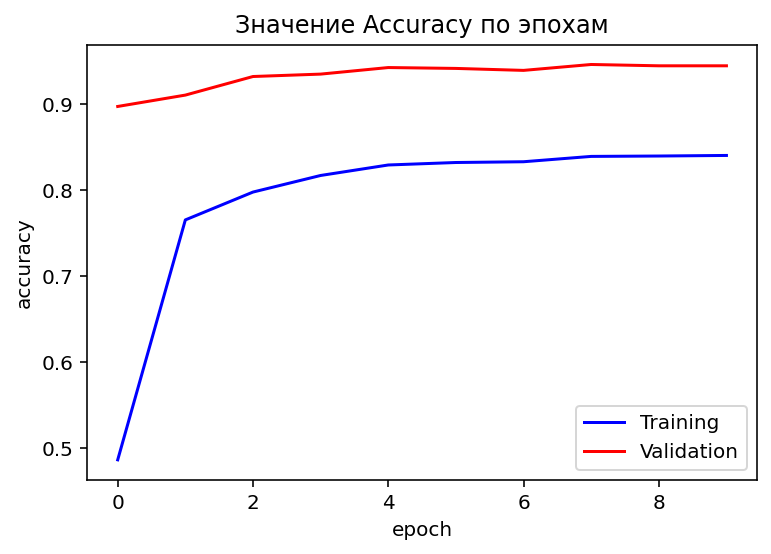

# Imagewoof-classification-PyTorch
Данный репозиторий содержит нейронную сеть, распознающую 10 пород собак: австралийский терьер, бордер-терьер, самоед, бигль, ши-тцу, английская гончая, родезийский риджбек, динго, золотистый ретривер и староанглийская овчарка. 

## Датасет
Для обучения модели был использован Imagewoof Dataset https://github.com/fastai/imagenette (подраздел Imagewoof).

## Архитектура сети
Для обучения была использована нейронная сеть ResNet50. Данная архитектура является одной из самых популярных для решения подобного класса задач. Подробнее можно прочитать по ссылке https://arxiv.org/pdf/1512.03385.pdf

## Веса модели
Обученные веса модели расположены по ссылке https://drive.google.com/file/d/1umw8zS6LUk3ntVbHHRzRvXBrpZcdxYrZ/view?usp=sharing

## Результаты
После 10 эпох обучения значение accuracy на валидационном наборе достигла почти 95%.

 

## Процедура запуска на локальной машине
Для развертывания на локальной машине необходимо скачать репозиторий
```{r, engine='bash', count_lines}
!git clone https://github.com/IvanPy96/Imagewoof-classification-PyTorch
```
Скачать и добавить в него веса. Далее запустить скрипт inference.py (вместо url вставить ссылку на любое изображение с собакой указанных 10 пород).

```{r, engine='bash', count_lines}
!python inference.py url
```
Результатом будет выведена порода собаки и степень уверенности модели. 
